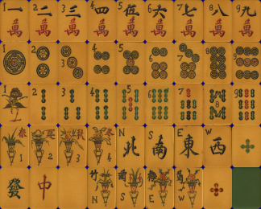

# Mahjongg
Wildly populare BeOS implementation with a rich and involved community that drove features and fun.

The default tile set is an original scan of traditional tiles (provided by the community) and it original to this app, though it has showed up in many other versions over the years

# Note

This was likely not the latest version of this codebase.  Move investigation is needed.
